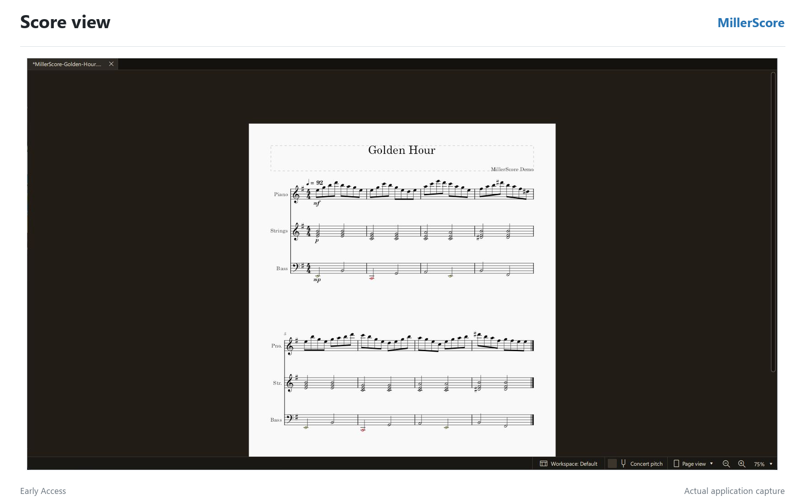
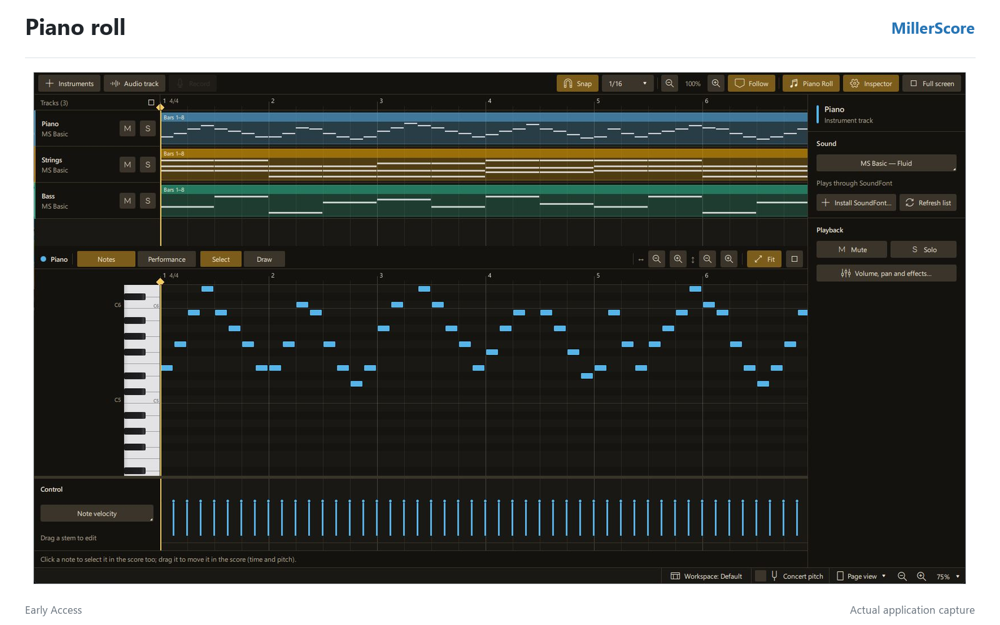
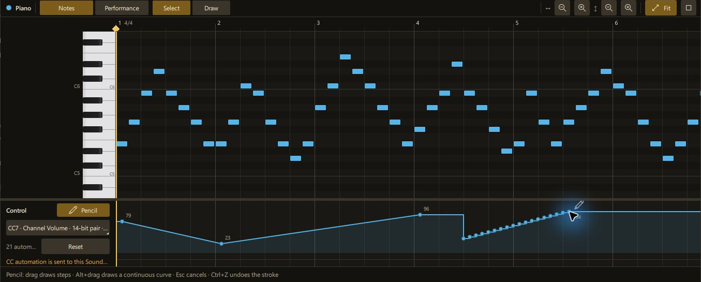
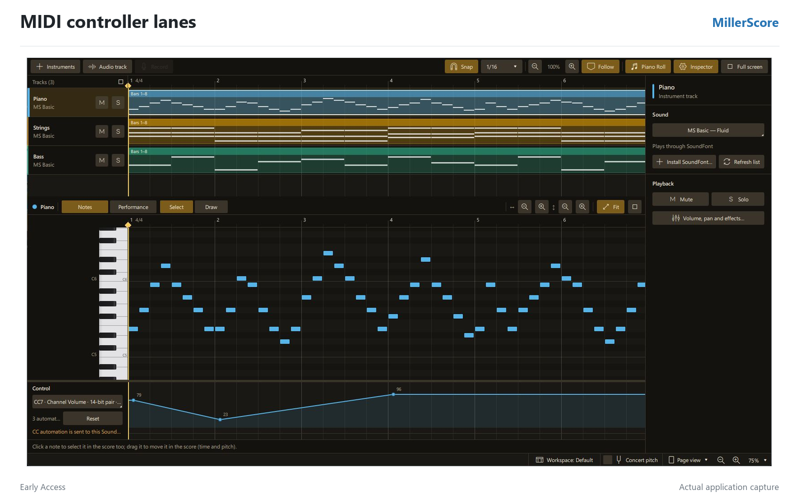
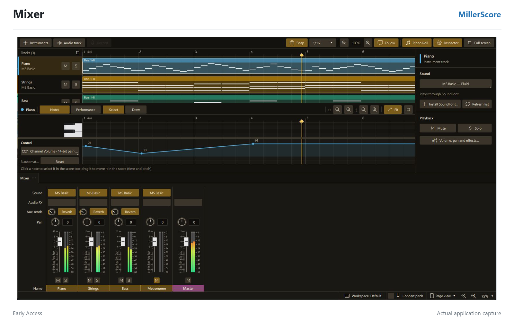

# MillerScore in pictures

These real application captures show the Golden Hour demo in Score, DAW and
the mixer. Follow the [user guide](index.html) for the complete workflow, or
view this gallery in [Brazilian Portuguese](pt-BR/CAPTURAS.md).

## 1. Open the score

Start in **Score** to read and edit the notation for Piano, Strings and Bass.

## 2. Switch to DAW

Use **DAW** to inspect the same music in the piano roll and velocity lane.
Choose an **MS Basic/SoundFont** instrument in the sound inspector for generic
CC playback.

## 3. Draw CC7 with Pencil

Select the Piano track and **CC7 — Channel Volume** to shape the receiving
SoundFont instrument's volume. Controller values are MIDI integers from 0 to 127.

Use **Pencil** beside **Control** and drag in the lane to draw stepped points.
Hold **Alt** while dragging for a continuous curve; Alt-drag also works with
Pencil off. Release to apply the whole stroke, **Ctrl+Z** to undo it, or **Esc**
to cancel before release. Turn **Snap** off for finer freehand detail.

This real capture shows the Pencil button and a newly drawn stepped stroke.
The existing points outside the stroke remain in place.

The [simple promotional image](../marketing/itchio-clean-v0.1.0/05-cc-pencil.png)
uses this same capture with three short instructions.

The older example below has three points and predates the Pencil button.

## 4. Check the mixer during playback

Open the **Mixer** to watch track and master meters and adjust the mix.
Generic CC7 changes the SoundFont instrument's volume; the mixer level is a
separate control.

## Controller playback scope

The 108 editable generic CC lanes send separate 7-bit values (0–127) only to
**MS Basic/SoundFont during main score playback**. The instrument can ignore
controllers it does not implement; paired lanes do not provide automatic
combined 14-bit control. The 20 protected controllers are read-only and never
sent. **Muse Sounds, VST3, external MIDI output and Standard MIDI File export
do not receive these generic DAW lanes.** See the
[controller guide](index.html#controllers) for the full catalog and safety rules.
